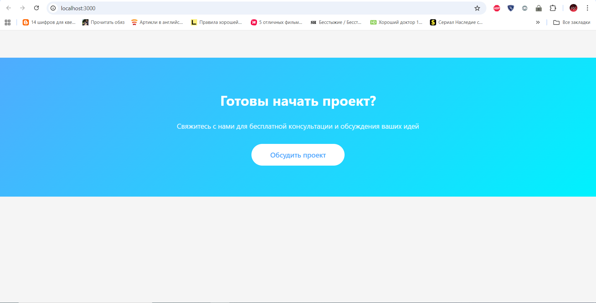
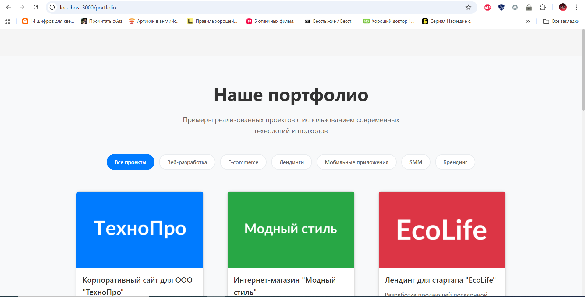
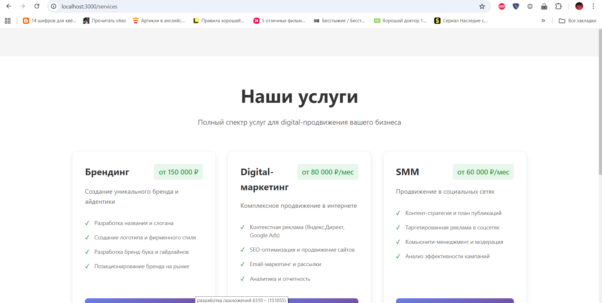
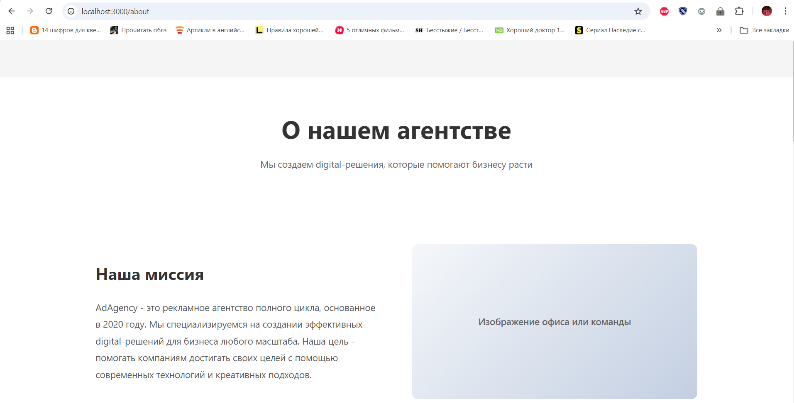
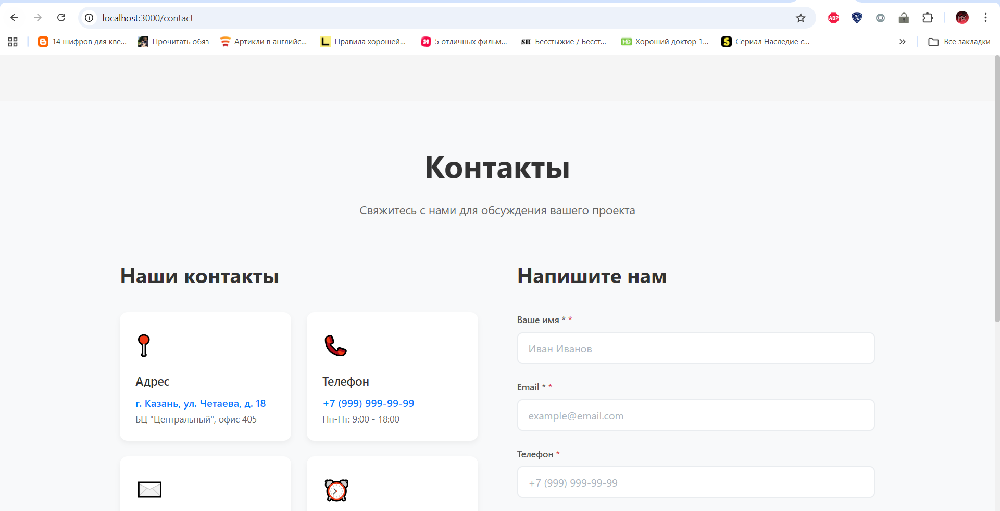

# Описание проекта

## Обзор проекта

Проект представляет собой веб-приложение рекламного агентства, состоящее из двух основных частей:

- **frontend/** - основное приложение сайта рекламного агентства
- **ui-library/** - библиотека переиспользуемых React компонентов

## Технологический стек

### Runtime зависимости:
- **React 19** с TypeScript - UI библиотека
- **React DOM** - рендеринг
- **React Router DOM** - маршрутизация
- **Framer Motion** - анимации
- **React Hook Form** - управление формами
- **@my-app/ui-library** - локальные UI компоненты

### Dev зависимости:
- **TypeScript** - статическая типизация
- **Vite** - сборщик и dev-сервер
- **ESLint** - линтинг кода
- **Jest** + Testing Library - тестирование
- **CSS Modules** - изолированные стили
- **Tailwind CSS** - утилитарные стили

## Архитектура проекта

!!!!!!!!!
## Компоненты библиотеки UI

### 1. PortfolioCase
Основной компонент для отображения кейсов портфолио:
- Название работы и описание
- Ключевые характеристики проекта
- Основное изображение и галерея
- Модальное окно с полной информацией
- Две кнопки: "Подробнее" и "Заказать"
- Адаптивный дизайн

### 2. PhotoGallery
Компонент галереи для отображения нескольких изображений:
- Навигация между изображениями
- Миниатюры для быстрого переключения
- Индикатор текущего изображения
- Адаптивный дизайн

### 3. Card
Базовый компонент карточки:
- Универсальный контейнер для контента
- Тени и скругления
- Hover-эффекты
- Поддержка кликов

### 4. Button
Базовая кнопка с вариантами стилей

### 5. Input
Однострочное поле ввода

### 6. Textarea
Многострочное поле для текста

## Маршрутизация приложения

- **Главная страница** (`/`) - лендинг со всеми секциями
- **Портфолио** (`/portfolio`) - страница с кейсами
- **Услуги** (`/services`) - детальное описание услуг
- **О нас** (`/about`) - информация о компании
- **Контакты** (`/contact`) - страница с контактами и формой

## Функциональные требования

✅ **Карточка содержит информацию о названии работы**  
✅ **Карточка содержит описание и ключевые характеристики**  
✅ **Карточка содержит изображение**  
✅ **При клике открывается модальное окно с полной информацией**  
✅ **Галерея изображений в модальном окне**  
✅ **Две кнопки: для просмотра кейса и для заказа**  
✅ **Все параметры передаются через props**  
✅ **Без использования сторонних UI библиотек**

## Инструкция по запуску

### Предварительные требования
- Node.js
- npm

### Установка и запуск

1. **Клонирование репозитория**
```bash
git clone <repository-url>
cd solution/student-17
```

2. **Установка зависимостей UI Library**
```bash
cd ui-library
npm install
npm run build
```

3. **Запуск демо-приложения**
```bash
cd ../frontend
npm install
npm install react-router-dom (при_необходимости)
npm run dev
```

4. **Открытие в браузере**
Приложение будет доступно по адресу: `http://localhost:3000`

## Скрипты проекта

### UI Library (ui-library/)
- `npm run build` - сборка библиотеки
- `npm run dev` - разработка с вотчером
- `npm run test` - запуск тестов
- `npm run test:coverage` - запуск тестов с покрытием >90%
- `npm run lint` - проверка кодстайла
- `npm run lint:fix` - автоматическое исправление ошибок

### Frontend (frontend/)
- `npm run dev` - запуск dev-сервера
- `npm run build` - сборка для production
- `npm run test` - запуск тестов
- `npm run lint` - проверка кодстайла

## Тестирование

```bash
# Тестирование библиотеки компонентов
cd ui-library
npm run test
npm run test:coverage

# Тестирование приложения
cd ../frontend
npm run test
```

## Особенности реализации

- ✅ **Полная типизация TypeScript** - без использования `any`
- ✅ **Тестовое покрытие >90%** для всех компонентов
- ✅ **ESLint с строгими правилами** - 2 пробела, без точек с запятой
- ✅ **Адаптивный дизайн** - работает на всех устройствах
- ✅ **Доступность** - поддержка клавиатурной навигации
- ✅ **Модульная архитектура** - ES6 импорты/экспорты
- ✅ **CSS Modules** - изолированные стили компонентов
- ✅ **Современный React** - хуки, контекст, порталы

# Архитектура проекта

## Обзор

Проект будет реализован с двумя основными проектами:
### frontend - основное приложение сайта рекламного агентства
### ui-library - библиотека переиспользуемых компонентов

## Структура frontend
frontend/
├── public/
│   ├── vite.svg
├── src/
    ├── components/
    │   ├── Header/
    │   │   ├── Header.tsx
    │   │   ├── Header.css
    │   │   └── index.ts           <-- Экспорт Header
    │   ├── Footer/
    │   │   ├── Footer.tsx
    │   │   ├── Footer.css
    │   │   └── index.ts           <-- Экспорт Footer
    │   ├── HeroSection/
    │   │   ├── HeroSection.tsx
    │   │   ├── HeroSection.css
    │   │   └── index.ts           <-- Экспорт HeroSection
    │   ├── ServicesSection/
    │   │   ├── ServicesSection.tsx
    │   │   ├── ServicesSection.css
    │   │   └── index.ts           <-- Экспорт ServicesSection
    │   ├── PortfolioSection/
    │   │   ├── PortfolioSection.tsx
    │   │   ├── PortfolioSection.css
    │   │   └── index.ts           <-- Экспорт PortfolioSection
    │   ├── ContactForm/
    │   │   ├── ContactForm.tsx
    │   │   ├── ContactForm.css
    │   │   └── index.ts           <-- Экспорт ContactForm
    │   ├── Modal/
    │   │   ├── Modal.tsx
    │   │   ├── Modal.css
    │   │   └── index.ts           <-- Экспорт Modal
    │   └── index.ts               <-- Реэкспорт ВСЕХ компонентов
    ├── pages/
    │   ├── HomePage/
    │   │   ├── HomePage.tsx
    │   │   ├── HomePage.css
    │   │   └── index.ts           <-- Экспорт HomePage
    │   ├── PortfolioPage/
    │   │   ├── PortfolioPage.tsx
    │   │   ├── PortfolioPage.css
    │   │   └── index.ts           <-- Экспорт PortfolioPage
    │   ├── ServicesPage/
    │   │   ├── ServicesPage.tsx
    │   │   ├── ServicesPage.css
    │   │   └── index.ts           <-- Экспорт ServicesPage
    │   ├── AboutPage/
    │   │   ├── AboutPage.tsx
    │   │   ├── AboutPage.css
    │   │   └── index.ts           <-- Экспорт AboutPage
    │   ├── ContactPage/
    │   │   ├── ContactPage.tsx
    │   │   ├── ContactPage.css
    │   │   └── index.ts           <-- Экспорт ContactPage
    │   └── index.ts               <-- Реэкспорт ВСЕХ страниц
    ├── utils/
    │   └── index.ts              <-- Экспорт всех утилит
    ├── types/
    │   └── index.ts              <-- Экспорт всех типов
    ├── App.css  
    ├── App.test.tsx
    ├── App.tsx  
    ├── index.css        
    ├── main.tsx
    └── setupTests.ts

├── .gitignore
├── eslint.config.js
├── index.html
├── jest.config.ts
├── package.json
├── tsconfig.json
├── tsconfig.node.json
├── tsconfig.app.json
└── vite.config.js

## Структура ui-library
ui-library/
├── src/
    ├── Button/
        ├── Button.css
        ├── Button.test.tsx
        ├── Button.tsx
        └── index.ts
    ├── Input/
        ├── Input.css
        ├── Input.test.tsx
        ├── Input.tsx
        └── index.ts
    ├── Textarea/
        ├── Textarea.css
        ├── Textarea.test.tsx
        ├── Textarea.tsx
        └── index.ts
    ├── Card/
        ├── Card.css
        ├── Card.test.tsx
        ├── Card.tsx
        └── index.ts
    ├── PortfolioCase/
        ├── PortfolioCase.css
        ├── PortfolioCase.test.tsx
        ├── PortfolioCase.tsx
        └── index.ts
    ├── PhotoGallery/
        ├── PhotoGallery.css
        ├── PhotoGallery.test.tsx
        ├── PhotoGallery.tsx
        └── index.ts
    ├── types/
        └── index.ts
    ├── index.ts
    └── setupTests.ts

├── package.json
├── eslint.config.js
├── jest.config.js
├── tsconfig.json
├── vite.config.js
└── .gitignore

## 📸 Скриншоты

### Главная страница


### Страница portfolio


### Страница services


### Страница about


### Страница contact
